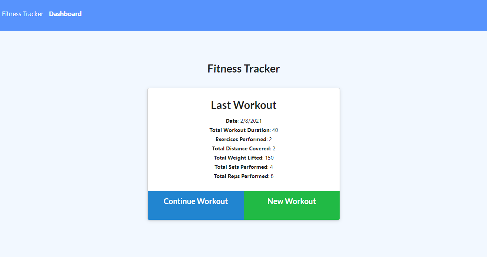

[](https://opensource.org/licenses/MIT)
# Fitness Tracking App

## Description

The Fitness Tracking App is a simple site that allows a user to track each of their workouts, as well as each of the exercises that they do during each workout. Once logged, the user can view their data in the pre-formatted Stats Dashboard. For this site, I built the server and back-end of the application using Express.js, MongoDB and Mongoose.js, and then deployed the project to Heroku using the MongoDB Atlas to save user data.


---------------------------

The deployed and functional site on Heroku can be found here: <https://sleepy-scrubland-01204.herokuapp.com/>

The full process can be found on [my Github](https://github.com/spencerv86/) repository linked here:
<https://github.com/spencerv86/fitness-tracker>


---------------------------

## Table of Contents

* [Installation](#installation)
* [Usage](#usage)
* [Credits](#credits)
* [License](#license)


## Installation

If you would like to inspect the code, please begin by forking the repository and downloading to your computer. Make sure that you have node already installed. 
You will likely need to run 
```npm install``` but no other files should be necessary. If you would like to add the seed data when running locally, you can run ```npm run seed``` to do so.

If you would simply like to see the app in action, no installation is needed, just click the following link: <https://sleepy-scrubland-01204.herokuapp.com/>

## Usage

When the site first loads, it will display the data of the user's most recent workout. The user can then choose to either "Continue Workout", to add to current workout's data, or "New Workout" to start logging data for a new workout.



Whichever is clicked, the user will be redirected to the exercise logging page where they will have the option to choose between a cardio or resistance based exercise. Once chosen, they will then be able to fill in all of the data relevant to that exercise.


After exercises have been logged, the user can then click on the Dashboard link in the navbar to be redirected to the Stats Dashboard. On this page, the user can find multiple auto-populated charts and graphs that will help them keep their fitness on track!


## Credits

Thanks to John, Pete, Kyle, Tony and Jeana Rose from my cohort for helping with some debugging issues! And as always, thanks to my instructional staff for the support!

## License

MIT License

Copyright (c) 2021 Spencer Vaughan

Permission is hereby granted, free of charge, to any person obtaining a copy
of this software and associated documentation files (the "Software"), to deal
in the Software without restriction, including without limitation the rights
to use, copy, modify, merge, publish, distribute, sublicense, and/or sell
copies of the Software, and to permit persons to whom the Software is
furnished to do so, subject to the following conditions:

The above copyright notice and this permission notice shall be included in all
copies or substantial portions of the Software.

THE SOFTWARE IS PROVIDED "AS IS", WITHOUT WARRANTY OF ANY KIND, EXPRESS OR
IMPLIED, INCLUDING BUT NOT LIMITED TO THE WARRANTIES OF MERCHANTABILITY,
FITNESS FOR A PARTICULAR PURPOSE AND NONINFRINGEMENT. IN NO EVENT SHALL THE
AUTHORS OR COPYRIGHT HOLDERS BE LIABLE FOR ANY CLAIM, DAMAGES OR OTHER
LIABILITY, WHETHER IN AN ACTION OF CONTRACT, TORT OR OTHERWISE, ARISING FROM,
OUT OF OR IN CONNECTION WITH THE SOFTWARE OR THE USE OR OTHER DEALINGS IN THE
SOFTWARE.